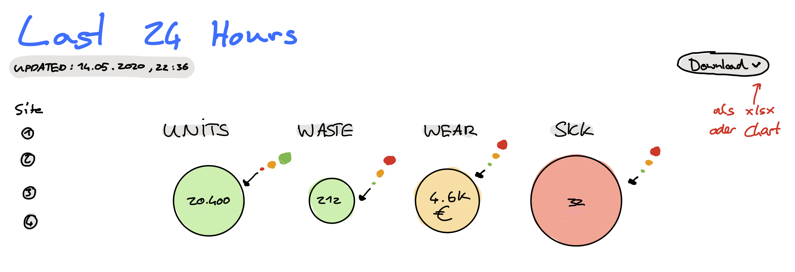
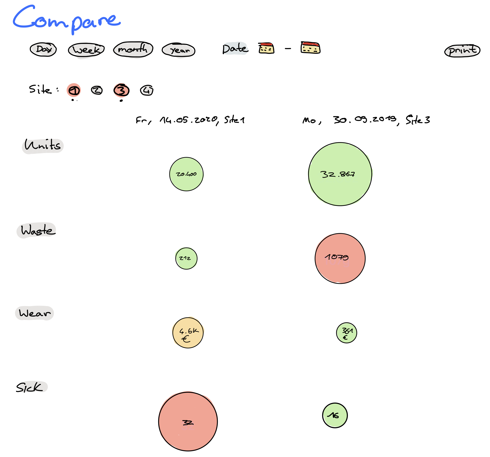

<body>

<H1> Konzept Aufgabe #02</H1>
<a href="Aufgabe_02_Yannis_Friedrich.pdf" target="_blank"><button>Download PDF</button></a>

Lofid Prototyp zur einfachen Darstellung von Produktionsrelevanten Daten

    <h2>Dashboard</h2>

    
Das Dashboard für die letzten 24 Stunden zeigt folgende Dinge:

    <ul>
        <li>Den Stand der letzten Aktualisierung</li>
        <li>Eine Auswahl für die Produktionsstätten</li>
        <li>Eine farbkodierte Anzeige für Stückzahlen, Ausschuss, Abnutzungskosten und krankgemeldete Mitarbeiter</li>
        <li>Einen Downloadbutton, über den die neusten Zahlen entweder als Excel-Datei oder als Diagramm heruntergeladen werden können.</li>
    </ul>

    <h2>Compare</h2>
    
    
In der Compare-Ansicht können Daten auf einfache Weise grafisch verglichen werden.

    <ol>
        <li>Zeitintervall wählen.</li>
        <li>Datum einstellen.</li>
        <li>Anzuzeigende Produktionsstätten auswählen.</li>
        <li>Zahlen vergleichen oder mit der print-Funktion direkt exportieren.</li>
    </ol>

    <h2>Classroom Feedback</h2>
    
Feedback im Rahmend er Veranstaltung

    <ul>
        <li>Sehr übersichtliches UI</li>
        <li>Farbkodierung ist eine gute Vereinfachung für einen schnellen Überblick</li>
        <li>Kreise sind eine gute Darstellungsform</li>
        <li> Gedanken über die Daten Eingabe machen</li>
    </ul>

</body>
