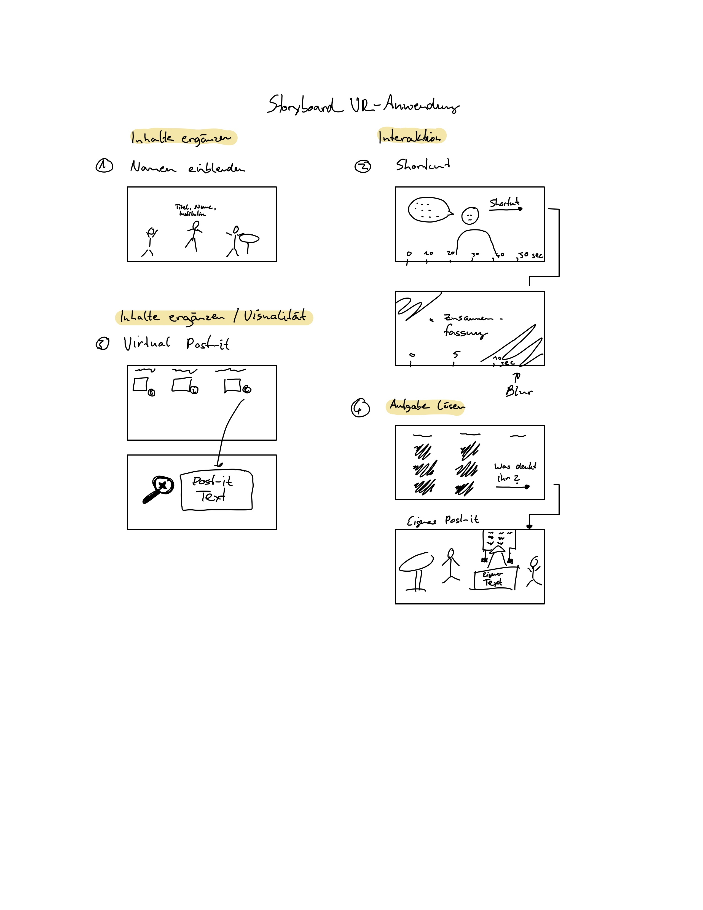

# Prototyp: VR-Anwendung für Hochschul-Content

## Storyboard

Das folgende Storyboard zeigt wie ein 360 grad Video um weitere Ebenen ergänzt werden könnte um dieses Format interessanter zu gestalten.

## Video Prototyp

## Idee für eine weitere Iteration

Nachdem ich das Video schon fertiggestellt hatte, kam mir noch eine weitere Idee. Es könnte spannend sein, wenn die Nutzer der Anwendung die Notitzzettel in der Anwednung Up- oder Downvoten könnten. Auf Basis dessen bestünde die Möglichkeit ein Ranking zu erstellen, aus dem ersichtlich wird, welche Aussagen die größte Resonanz erhalten.